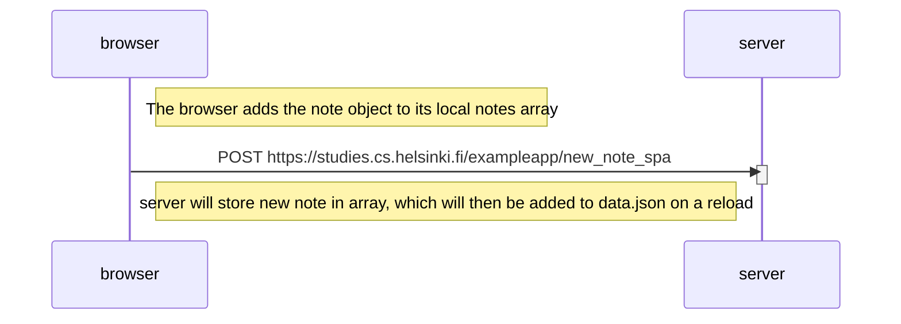

```mermaid

sequenceDiagram
    participant browser
    participant server
    
    Note right of browser: The browser adds the note object to its local notes array
    browser->>server: POST https://studies.cs.helsinki.fi/exampleapp/new_note_spa
    activate server
    deactivate server
    Note left of server: server will store new note in array, which will then be added to data.json on a reload

```

